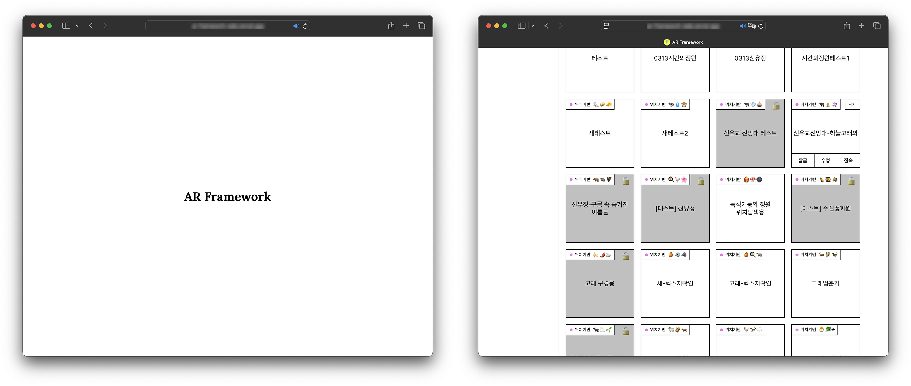
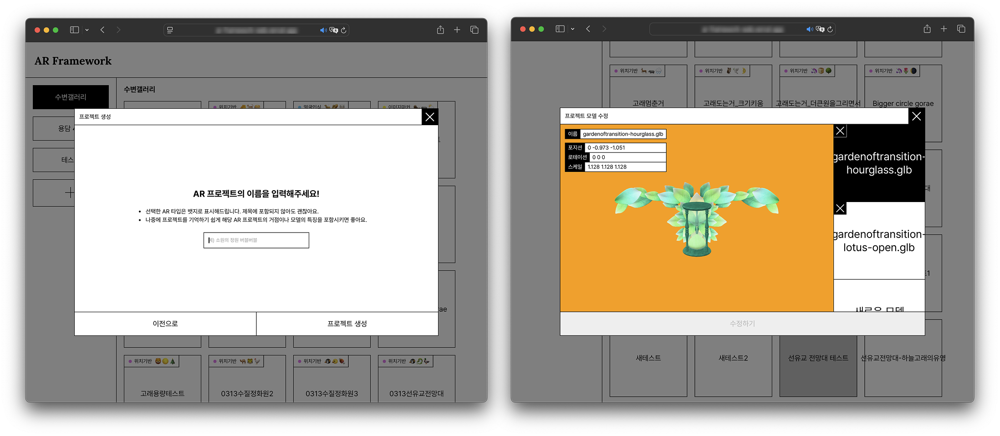

# AR Framework

## 사용 기술

해당 프로젝트는 3개 종류의 AR 컨텐츠를 생성하고 에디팅 할 수 있는 기능을 가지고 있습니다.

- 위치 기반(GPS) AR은 [`AR.js`](https://ar-js-org.github.io/AR.js-Docs/) 를 사용,
- 얼굴 인식 AR은 [`Mind.AR`](https://hiukim.github.io/mind-ar-js-doc/) 을 사용,
- 이미지 마커 인식 AR은 [`Mind.AR`](https://hiukim.github.io/mind-ar-js-doc/) 을 사용합니다.

## 주요 기능

크게 세 가지의 기능이 있으며, 이들을 각각의 서브패키지로 나누어 작성했습니다.

각 서브패키지와 관련된 내용은 각 서브패키지 디렉터리의 `readme.md` 를 참고하세요.

#### AR 종류를 골라 컨텐츠를 생성하고 수정하기 (`/web`)

메인화면과 컨텐츠 리스트

컨텐츠 생성하기 (1, 2단계)

컨텐츠 생성 (3단계로 완료), 컨텐츠 수정하기 (3D 모델 추가/제거)

#### 모바일 화면에서 프로젝트에 탑재된 3D 모델의 위치와 크기 회전을 조정 (`/packages/controls`)

#### AR 컨텐츠 캡쳐 로직 제공 (`/packages/capturer`)

## 개발환경 세팅

#### 1. 환경변수 설정

`@ar-framework/controls` 등의 서브패키지 빌드에 사용되는 환경변수는 프로젝트 루트 디렉토리의 `.env` 에 작성되어야 합니다.

자세한 환경변수 리스트는 `.env.example` 을 참고하세요.

#### 2. yarn berry 의 vscode 설정

하지 않으면 Next.js 프로젝트에서 `cannot find module~` TS 에러를 확인하게 됩니다.

- 타입스크립트 파일을 선택한 상태에서 `ctrl+shift+p` 를 누릅니다.
- "Select TypeScript Version" 를 선택합니다.
- "Use Workspace Version" 를 선택합니다.

#### 3. 프로젝트 클론 이후 `yarn install` 은 필요합니다

루트 디렉터리에서 꼭 yarn install을 실행해주세요.

#### 4. yarn workspace를 사용한 프로젝트의 의존성 설치방법

`web` 이라는 워크스페이스 (모노레포의 서브패키지)에 `lodash` 라는 모듈을 추가할 때

- yarn workspace web add `lodash`

제거할 때

- yarn workspace web remove `lodash`
