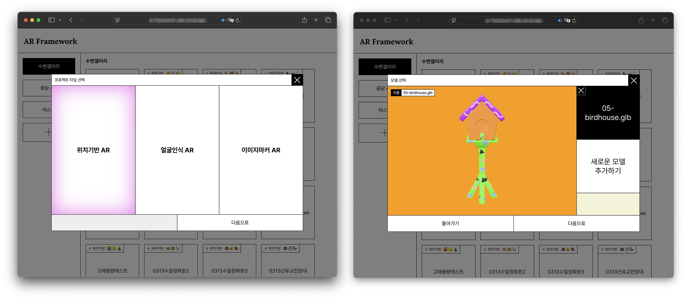
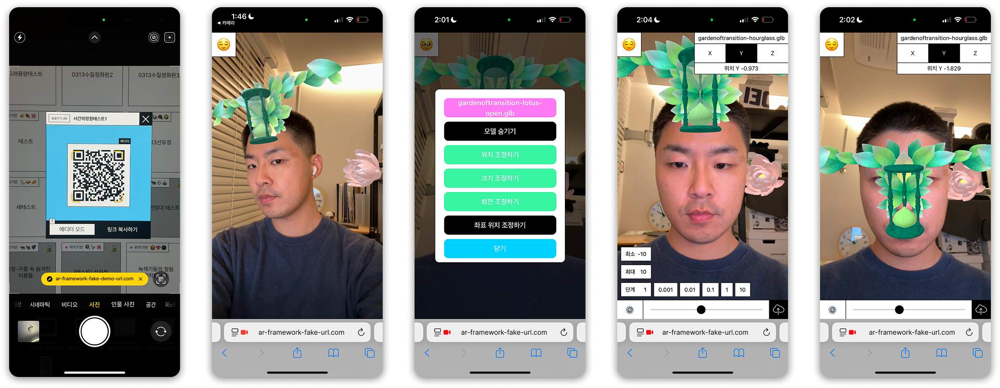

# AR Framework


저는 크리에이티브 스튜디오 [**레벨나인(Rebel9)**](https://rebel9.co.kr)에서 여러가지 웹 기반 인터랙티브 프로젝트들의 개발에 참여하였습니다. 특히 AR 컨텐츠를 담은 모바일 웹 애플리케이션들을 [**다수 개발**](https://dglee.dev?tag=ar)하였는데, 모바일 웹이라는 접근성 높은 인터페이스를 통해 오프라인 공간에 3D 모델 증강을 통한 새로운 시각적 경험을 제공하여 주로 지역의 특성을 제고시킬 수 있는 홍보 수단으로서 제작되었습니다

**AR Framework**는 반복적인 AR 컨텐츠 개발을 경험하며 쌓은 AR 컨텐츠 제작의 노하우를 하나의 템플릿에 모으고, UI 인터페이스를 통해 노코드 환경에서 AR 컨텐츠를 효율적으로 생산하고 편집하며, 완성된 컨텐츠와 외부 개발 환경의 연동을 간편하게 만들기 위한 인터페이스와 도구들의 묶음으로 만들어진 <b>컨텐츠 제작 프레임워크</b> 입니다.

<br />

## 기능 소개

### 컨텐츠 생성과 3D 모델 탑재



### 3D 모델 관련 수치 편집 및 저장



### 메시지 인터페이스

AR Framework에서 제작된 컨텐츠는 서버사이드 렌더링되는 HTML 문서로서, 각각의 URI로 제공됩니다.
React등으로 개발된 별개의 클라이언트에서 iframe을 이용해 AR 컨텐츠를 런타임에서 통합할 수 있도록 메시지 인터페이스를 설계하여 라이브러리([**@ar-framework/utils**](https://www.npmjs.com/package/@ar-framework/utils))로 제공합니다.

```javascript
const showGlbModels = () => {
  messenger.postMessage({
    type: "show-glb-models",
    payload: null,
  });
};

const showCaptureButton = () => {
  messenger.postMessage({
    type: "show-capture-button",
    payload: null,
  });
};

const triggerCapture = () => {
  messenger.postMessage({
    type: "trigger-capture",
    payload: null,
  });
};
```

<br />

## 프로젝트 구조

AR Framework는 위에서 소개된 것과 같이 여러 기능을 하나의 프레임워크로 제공하는 프로젝트입니다. 이러한 특성을 반영하여 각각의 기능을 모듈 단위로 구현하되 하나의 워크스페이스에서 관리될 수 있도록 `yarn workspace` 를 이용해 모노레포로 구성되었습니다.

각 모듈의 패키지 명은 다음과 같습니다.

- `@ar-framework/web`: 웹사이트의 사용자 인터페이스(UI)를 구성하는 프로젝트입니다. Next.js로 작성되었으며, 다른 패키지들을 소비하는 메인 패키지 역할을 합니다.
- `@ar-framework/controls`: 3D 모델의 위치, 크기, 회전, 좌표와 관련된 수치를 UI를 통해 편집하고 저장할 수 있도록하는 React.js 기반의 서비스 패키지입니다. parcel로 빌드되어 웹 프로젝트의 퍼블릭 폴더에 주입되는 형태로 배포됩니다.
- `@ar-framework/utils`: AR Framework로 서빙되는 AR 컨텐츠의 런타임 통합을 위해 iframe과 메시지 인터페이스를 제공하는 리액트 훅입니다. parcel로 빌드되며 npm package로 배포됩니다.
- `@ar-framework/capturer`: 3D scene과 비디오 피드를 하나의 canvas로 캡쳐해 blob으로 제공하는 유틸리티 함수입니다. parcel로 빌드되며 웹 프로젝트의 퍼블릭 폴더에 주입됩니다.
