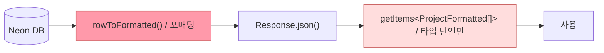
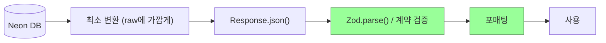
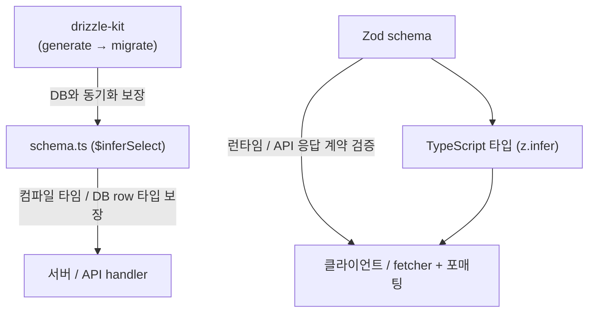

# 클라이언트 검증 및 포매팅 설계

Memex 시절에는 서버(BFF)가 raw 데이터를 그대로 반환하고, 클라이언트의 `useProjects` `select` 옵션에서 `formatProjectList()`를 호출해 포매팅했다. Neon으로 마이그레이션할 때(`8e717d3`) Neon 핸들러에 `rowToFormatted()`를 추가하면서 포매팅이 서버로 이동했고, 클라이언트의 포매팅 로직은 제거됐다. 결과적으로 원래 구조보다 오히려 후퇴한 형태가 됐다.

## 현재 구조

- 서버에서 포매팅까지 수행 후 응답
- 클라이언트는 제네릭 타입 단언만 사용 — 런타임 검증 없음
- `rowToFormatted()`의 nullish coalescing fallback(`?? ""` / `?? false`)이 DB의 null/undefined를 조용히 흡수해 데이터 이상을 런타임에서 감지할 수 없음 (silent failure)

서버에서 포매팅을 해버리면 클라이언트가 받는 데이터 shape가 서버 구현에 종속된다. 백엔드가 또 바뀔 경우 포매팅 로직도 함께 이전해야 하고, 클라이언트 입장에서는 "내가 기대하는 shape"를 코드로 명시할 수단이 없다. 현재처럼 타입 단언만 있으면 서버가 shape를 어기더라도 런타임에서 조용히 넘어간다.

## 변경 이유

- 백엔드 레이어가 Memex → Neon으로 이미 한 차례 교체된 경험이 있고, 추후 또 바뀔 여지가 있음
- 서버 내부는 Drizzle 스키마(`$inferSelect`)를 원천으로 두면 컴파일 타임에 타입이 보장됨
- 따라서 서버를 신뢰하는 것이 아니라 **API 응답 계약**을 클라이언트가 직접 보유하는 구조가 더 견고함

## 변경 방향

- 서버는 DB 데이터를 최소 변환만 해서 전달
- 클라이언트에서 Zod로 응답 shape를 검증한 뒤 포매팅 수행
- Zod 스키마를 타입의 원천으로 사용 (`z.infer<typeof schema>`로 타입 파생)

## 레이어별 역할

`drizzle-kit` 없이 `schema.ts`를 수동으로 관리하면 실제 DB 테이블과 어긋나도 컴파일 타임에 잡히지 않는다. `drizzle-kit`을 사용해 `schema.ts` 수정 → migration 생성 → 적용 순서를 강제해야 `$inferSelect`가 실제 DB 구조를 신뢰할 수 있는 원천이 된다.

→ 워크플로 상세: [drizzle-kit-migration-workflow.md](./drizzle-kit-migration-workflow.md)
